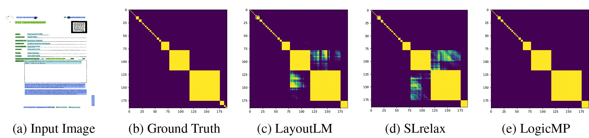

# LogicMP
It is the official repository of [LogicMP](https://arxiv.org/abs/2309.15458) where MP stands for message passing. LogicMP aims to combine neural networks (semantic representations) with first-order logic (symbolic knowledge). 


Note: The code for the relational graphs is included. Due to the privacy issues in Ant Group, the code for document images cannot be fully provided. Even though, I will show it is easy to reimplement.

# An Example: Transitivity rule in Document Images

## Task definition
Task: Given the input image and input tokens, the task is to develop a function to predict whether two tokens coexist in a block. 
Rule: If tokens $i$ and $j$ are in the same block and tokens $j$ and $k$ are also together, then tokens $i$ and $k$ should be in the same block. Formally, $\forall i, j, k: \mathtt{C}(i, j) \wedge \mathtt{C}(j, k) \implies \mathtt{C}(i, k)$.

.

## Tutorial: How to apply LogicMP in this example?

### Convert the rule to equivalent implications
The transitivity rule is $\forall i, j, k: \mathtt{C}(i, j) \wedge \mathtt{C}(j, k) \implies \mathtt{C}(i, k)$. It has three equivalent implication statements (implications in short):

- $\forall i, j, k: \mathtt{C}(i, j) \wedge \mathtt{C}(j, k) \implies \mathtt{C}(i, k)$. It means that when (i, j) coexist and (j, k) coexist, then (i, k) coexist.
- $\forall i, j, k: \neg \mathtt{C}(i, k) \wedge \mathtt{C}(j, k) \implies \neg \mathtt{C}(i, j)$. It means that when (i, k) coexist and (j, k) don't exist, then (i, j) don't coexist.
- $\forall I, j, k: \neg \mathtt{C}(i, k) \wedge \mathtt{C}(i, j) \implies \neg \mathtt{C}(j, k)$. It means that when (i, k) coexist and (i, j) don't exist, then (j, k) don't coexist.

The above three rules are equivalent. They are the same rule in three different statements.

### Convert the implications to tensor computation with Einsum.

Each implication corresponds to a message passing:

- msg_to_ik =   einsum('bij,bjk->bik', Q[...,1], Q[...,1]) 
- msg_to_ij = - einsum('bjk,bik->bij', Q[...,1], Q[...,0])
- msg_to_jk = - einsum('bij,bik->bjk', Q[...,1], Q[...,0])

where b stands for dimension batchsize, Q is the marginal of size [BatchSize, #Entities, #Entities, 2] (2 for binary classification).

### Combine the message passing in the iterations.

```
# logits: torch.Tensor, size=[batchsize, nentities, nentities, 2]
# niterations: int, number of iterations
cur_logits = logits.clone()
for i in range(niterations):
  Q = softmax(cur_logits, dim=-1)
  cur_logits = logits.clone()
  # Message Aggregation for Implication ∀i, j, k : C(i, j) ∧ C(j, k) => C(i, k)
  msg_to_ik = einsum(’bij,bjk->bik’, Q[...,1], Q[...,1])
  # Message Aggregation for Implication ∀i, j, k : C(i, j) ∧ ¬C(i, k) => ¬C(j, k)
  msg_to_jk = - einsum(’bij,bik->bjk’, Q[...,1], Q[...,0])
  # Message Aggregation for Implication ∀i, j, k : C(j, k) ∧ ¬C(i, k) => ¬C(i, j)
  msg_to_ij = - einsum(’bjk,bik->bij’, Q[...,1], Q[...,0])
  msg = msg_to_ij + msg_to_jk + msg_to_ik
  cur_logits[..., 1] += msg * weight
# Returns cur_logit
```

As shown in this code, any first-order logic with **universal quantifier** can be converted into Einsum operations, turning previous MLN inference problem into forward tensor computations in milliseconds.

# LogicMP utils: As a logic Language

Here we provide a package to parse the first-order logic and automatically convert it into the LogicMP layer.

### Import
```
from logicmp import *
```

### Define the fields and predicates
```
    # step 1: define the fields
    token = Field('token', list(range(512)))    

    # step 2: define the predicates
    coexist = Predicate('coexist', [token, token])
    name2predicate = {'coexist': coexist}
```

### Define the LogicMP
```
    # step 3: define the LogicMP
    # rules in str
    fstr = 'forall i: forall j: forall k: coexist(i, j) & coexist(i, k)  -> coexist(j, k)'
    # parse the rules
    ftree = pyparsing_parse(fstr)
    print(ftree)
    # using predefined classes
    formula = construct(ftree, name2predicate)
    print(formula)
    res = is_conjunctive_normal_form(formula)
    print(res)
    # to CNF
    formula = formula.apply()
    print(formula)
    res = is_conjunctive_normal_form(formula)
    print(res)
    logicmp = LogicMP(formula.clauses(), 5)
```

### Using LogicMP as a torch NN layer
```
    logits = LayoutLM(tokens) # logits: [batchsize, entities, entities, 2]
    logits = LogicMP({'token': logits})
    prob = torch.nn.softmax(logits, dim=-1)
```
